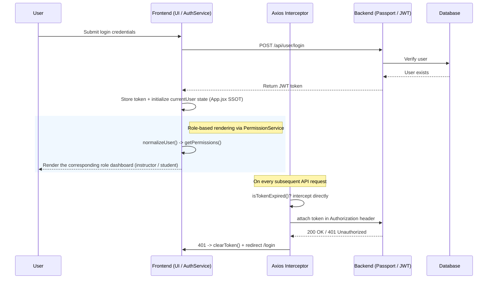

[English](README.md) | [繁體中文](README.zh-TW.md)

# MERN Course Management System — A Full-Stack Defensive Architecture

This project focuses on authentication-state consistency, an issue that is easy to overlook in full-stack SPA development. `App.jsx` owns the main UI auth state, localStorage provides persistence, Axios performs two-layer token checks, and route-level plus global ErrorBoundary components handle frontend failures that can be isolated.

- **Live Demo**: [course.tinahu.dev](https://course.tinahu.dev/)
- **Test Accounts**:
  - Student: `demo.student@tinahu.dev` / `DemoCourse2026`
  - Instructor: instructor registration requires an invite code, available on request during an interview.

---


---

## Engineering Differentiators

This project isn't about "getting features to work" — it's aimed at the structural problems that quietly accumulate in most portfolio projects:

| Common portfolio approach                                     | This project's decision                          | Engineering rationale                                                                               |
| ------------------------------------------------------------- | ------------------------------------------------ | --------------------------------------------------------------------------------------------------- |
| Frontend and backend validation rules drift independently     | **Mirrored Joi schemas**                         | Validates at both the UI and API boundaries; rule changes require both schemas and their tests to be updated |
| Permission checks scattered across UI components              | **Permission Service + Adapter**                 | Centralizes the main role, course-action, and user-shape checks to reduce duplicate view logic      |
| Reaching for Redux/Zustand too early in a small application   | **`App.jsx` primary state + unidirectional Props** | Props carry the main UI auth state, while localStorage handles persistence and HTTP-layer token reads |
| Letting a possibly-expired token go out with a request        | **Two-layer JWT defense (pre-check + backstop)** | Saves wasted round trips; prevents the frontend from falling into an infinite 401 redirect loop     |

---

## Architecture & Engineering Decisions

### 1. State Management: Practicing SSOT While Consciously Avoiding Overengineering

**Root problem**: `currentUser` is consumed by three modules at once — the nav bar (displays identity), the login page (writes state), and the Axios interceptor (reads the token). If any one consumer holds a stale cache, the system enters a ghost state: the UI shows "logged in" while the API returns `401`.

**Decision**: Without introducing Redux/Zustand too early, `App.jsx` owns the main UI authentication state. `LoginPage` and `Nav` handle login writes and logout clearing, then pass state to the main pages through props. `localStorage` remains the persistence layer and the token source read by the Axios interceptor.

```jsx
// App.jsx — centralized state, enforcing unidirectional data flow via Props
const [currentUser, setCurrentUser] = useState(AuthService.getCurrentUser());
```

**Trade-off assessment**: At the current component depth and feature scope, this avoids store boilerplate, but authentication state still spans React state and localStorage. If cross-component interactions and state sources grow, migrating to Zustand or another centralized store can be evaluated with that limitation in mind.

---

### 2. Two-Layer JWT Defense: Client-Side Pre-Check and Server-Side Backstop

Token expiry has two fundamentally different failure modes. Handling both with the same strategy either wastes network round trips or leads to an uncontrollable redirect loop. This architecture handles each at the layer where it belongs:

| Defense layer                  | Scenario                               | Strategy and engineering payoff                                                                                                                                                                       |
| ------------------------------ | -------------------------------------- | ----------------------------------------------------------------------------------------------------------------------------------------------------------------------------------------------------- |
| **Layer 1: Request pre-check** | Token `exp` has passed                 | Parsed and intercepted client-side before the request is sent, saving a wasted round trip and server-side validation load. `isTokenExpired()` builds in a 10-second buffer to account for clock skew. |
| **Layer 2: Response backstop** | The backend rejects an expired, invalid, or otherwise unverifiable token | Catches `401 Unauthorized` and clears the local session; login endpoint failures remain available to the form for user feedback. |

```javascript
// axios.service.js — Layer 1: intercept before the request leaves the client
if (isTokenExpired(token)) {
  clearToken();
  window.location.href = '/login';
  return Promise.reject(new Error('Token expired')); // stop here, no invalid request sent
}
```

**Boundary design**: `isTokenExpired()` uses an asymmetric safety strategy — a malformed token (tampering) returns `true` and triggers logout (favoring security); a token missing the `exp` field returns `false` and is treated as valid (favoring fault tolerance).

---

### 3. Service-Layer Adapter Pattern: Isolating API Structural Instability

**Root problem**: Login responses and localStorage currently use the nested `{ token, user }` shape, while some service boundaries or future APIs may pass a flat user object. Letting each UI component handle both forms would duplicate shape checks across call sites.

**Decision**: `PermissionService` applies an Adapter-style normalization step. The main course permission flow uses `normalizeUser()` and semantic methods; a few route-entry components still contain direct role checks and remain candidates for further consolidation.

```javascript
// permission.service.jsx
static normalizeUser(userLike) {
  if (!userLike) return null;
  if (userLike.user && typeof userLike.user === 'object') return userLike.user; // nested shape
  if (userLike._id || userLike.id) return userLike;                              // flat shape (supports both _id and id aliasing)
  return null;
}
```

**Payoff**: The main course authorization flow can reuse one set of normalization and semantic methods, reducing the number of UI call sites affected by common user-shape changes.

---

### 4. Three Structural Defensive Guarantees

**(A) Cross-Tab State Synchronization**

If a user opens two tabs and logs out in Tab A, and Tab B's auth state doesn't clear along with it, that's a genuine permission security gap. Wrapping the native `storage` event provides lightweight cross-tab state synchronization:

```javascript
// useAuthUser.jsx
window.addEventListener('storage', (e) => {
  if (e.key === 'user') {
    try {
      setRaw(e.newValue ? JSON.parse(e.newValue) : null);
    } catch {
      setRaw(null);
    } // fail-safe: corrupted JSON must not crash the hook
  }
});
```

**(B) Two-Layer Depth ErrorBoundary (Graceful Degradation)**

Error isolation uses a two-layer depth design: an outer global `<ErrorBoundary>` wraps the entire `<Routes>` as a final backstop; each lazy-loaded route is wrapped again by its own `<ErrorBoundary>`, confining the blast radius of an error to a single page:

```jsx
// App.jsx — Two-layer depth defense structure
<ErrorBoundary>
  {' '}
  {/* global final backstop */}
  <Routes>
    <ErrorBoundary fallback={<ErrorFallback />}>
      {' '}
      {/* route-level isolated guard */}
      <Suspense fallback={<PageLoader />}>
        {' '}
        {/* async chunk loading state */}
        <Page {...props} />
      </Suspense>
    </ErrorBoundary>
  </Routes>
</ErrorBoundary>
```

A render error or dynamic-chunk failure inside a lazy route can display a route-level fallback. The outer boundary remains the final backstop for errors not handled by the inner route boundary.

**(C) Read/Write-Split Error Handling Strategy**

- **Read operations** (e.g. fetching a course list): the underlying catch returns an empty array `[]`, degrading gracefully and avoiding an interruption to overall rendering.
- **Write operations**: `dropCourse` distinguishes a server rejection (`error.response`) from a request with no response (`error.request`). Other write methods propagate errors to their calling pages, which render the corresponding user feedback.

---

### 5. Frontend Performance Tuning: Critical Rendering Path Optimization

**(A) Selective Lazy Loading (Not Blanket Lazy-Loading)**

`HomePage` stays synchronously loaded to keep LCP as fast as possible. Secondary routes use `React.lazy()` for code splitting, substantially trimming the initial JS bundle size without sacrificing first-paint speed.

**(B) Below-the-Fold Deferred Loading**

`<Footer />` and other below-the-fold content are lazy-loaded at the component level, further improving TTI (time to interactive).

**(C) ChunkLoadError Fault Tolerance**

Every dynamically loaded chunk has its own `<Suspense>` skeleton transition and is wrapped in a local `<ErrorBoundary>`. When a production redeploy invalidates the cache, the result is an isolated error state rather than a blank white page.

---

## System Architecture



---

## Technology Choices and Trade-offs

| Technology                               | Rationale (engineering considerations)                                                                                                                                                                                               |
| ---------------------------------------- | ------------------------------------------------------------------------------------------------------------------------------------------------------------------------------------------------------------------------------------ |
| **React 18 + Vite 6**                    | Uses ESM and fast HMR during development; recent local production builds completed in roughly 5–8 seconds. `React.lazy` and `Suspense` provide route-level code splitting and loading feedback. |
| **React Router v6**                      | Nested routes + Outlet cleanly separate the layout shell from page rendering logic, letting ErrorBoundary cover failing modules with fine-grained precision.                                                                         |
| **Axios (custom instance)**              | The interceptor mechanism is the key infrastructure behind the two-layer token defense; switching to native `fetch` would degrade the core interception logic into boilerplate scattered everywhere.                                 |
| **Joi (mirrored frontend/backend schemas)** | Frontend pre-checks improve immediate feedback, while the backend schema remains the non-bypassable data boundary. The two schema copies are kept aligned through synchronized changes and tests. |
| **Passport.js JWT**                      | The Strategy pattern decouples authentication from business logic; adding OAuth later follows the open/closed principle — existing routes wouldn't need to change.                                                                   |
| **Helmet.js**                            | Automatically injects security HTTP headers (CSP, X-Frame-Options, etc.) at very low cost.                                                                                                                                           |
| **MongoDB + Mongoose**                   | User and Course maintain two-way ObjectId references for queries from either direction. This adds write-consistency cost; actual query performance still depends on indexes and query-plan verification. |

---

## Development and Deployment Guide

### 1. Clone the project

```bash
git clone https://github.com/yuting813/course-management-system.git
cd course-management-system
```

### 2. Install dependencies

```bash
# Backend dependencies
npm install

# Frontend dependencies
npm run clientinstall
```

### 3. Configure environment variables

```bash
# Create .env files in both the root and the client directory
cp .env.example .env
cd client && cp .env.example .env
```

| Variable             | Description                                       |
| -------------------- | ------------------------------------------------- |
| `MONGODB_CONNECTION` | MongoDB Atlas connection string                   |
| `PASSPORT_SECRET`    | Secret used for JWT signing and Passport JWT verification |
| `INSTRUCTOR_INVITE_CODE` | Invite code required for instructor registration |
| `VITE_API_BASE_URL`  | Backend API base URL for the frontend             |

### 4. Start the dev server

```bash
npm run dev   # starts both frontend and backend concurrently (nodemon + Vite)
```

### Deployment Architecture

| Layer                  | Platform      | Notes                                                       |
| ---------------------- | ------------- | ----------------------------------------------------------- |
| Frontend static assets | Vercel        | Deployed via Edge Network with automated CI/CD              |
| Backend API            | Render        | Managed Node.js runtime                                     |
| Database               | MongoDB Atlas | Managed database with IP allowlisting for baseline security |

---

## Data Model

```
users/
  { _id, username, email, password (bcrypt hash, stripped automatically by toJSON()), role, date, courses[] }
  ↕ two-way reference (ObjectId)
courses/
  { _id, title, description, price, instructor (ref User), students[] (ref User), image, createdAt }
```

**Mongoose middleware design**: `pre('save')` hashes the password on creation or modification. A User document's `toJSON()` removes `password` during serialization, and the Passport query explicitly uses `.select('-password')`.

---

## Technical Debt and Optimization Roadmap

The current architecture prioritizes development speed and core stability. For future enterprise-scale needs, the following optimizations are planned:

1. **Controller pattern refactor**: business logic is currently coupled to routes (fat routes). Extracting it into a `controllers/` layer would improve testability and align with the single responsibility principle.

2. **Auth scheme alignment**: currently uses a custom `JWT` scheme for learning purposes. Migrating to the industry-standard `Bearer` scheme (RFC 6750) would ensure compatibility with third-party API gateways and security tooling.

3. **Expand centralized error handling**: a global error middleware already exists, but some course routes still construct responses directly. A shared `AppError` plus `next(error)` flow can make the JSON error shape more consistent.

4. **Proper logging**: `console.log` is only suitable for development. Integrating a structured logging library like Winston or Pino would enable log levels and rotation for production auditing.

5. **Distributed caching layer**: every authentication currently hits the database directly. Introducing Redis as a session/user-metadata cache would meaningfully reduce DB I/O pressure under high concurrency.

---

## About the Author

With a background in procurement management, I've long carried the habit of **anticipating known failure modes** and **designing backstops for unpredictable risk**. That mental model maps directly onto software architecture:

- **Procurement compliance specs → mirrored frontend/backend schemas**: dirty data is caught at the UI boundary, not discovered later at the database layer.
- **Supplier risk tiering → two-layer JWT defense**: known expiry is blocked before a request is sent; a backend `401` caused by an invalid or unverifiable token is handled by the response interceptor.
- **Budget ROI discipline → frontend performance tuning**: network requests and bundle size are treated as constrained resources; every byte loaded should earn its place in the critical rendering path.

To me, maintainability and predictability were never a slogan — they're built one `if (!user) return false` and one boundary `catch` block at a time.

- **Website**: [tinahu.dev](https://www.tinahu.dev/)
- **GitHub**: [yuting813](https://github.com/yuting813)
- **Email**: [tinahuu321@gmail.com](mailto:tinahuu321@gmail.com)

---

> **Educational Use Disclaimer**
> This project is solely for personal technical demonstration and learning purposes. All third-party trademarks, service names, and logos belong to their respective owners. This project involves no commercial activity and has no commercial affiliation with any third party.
