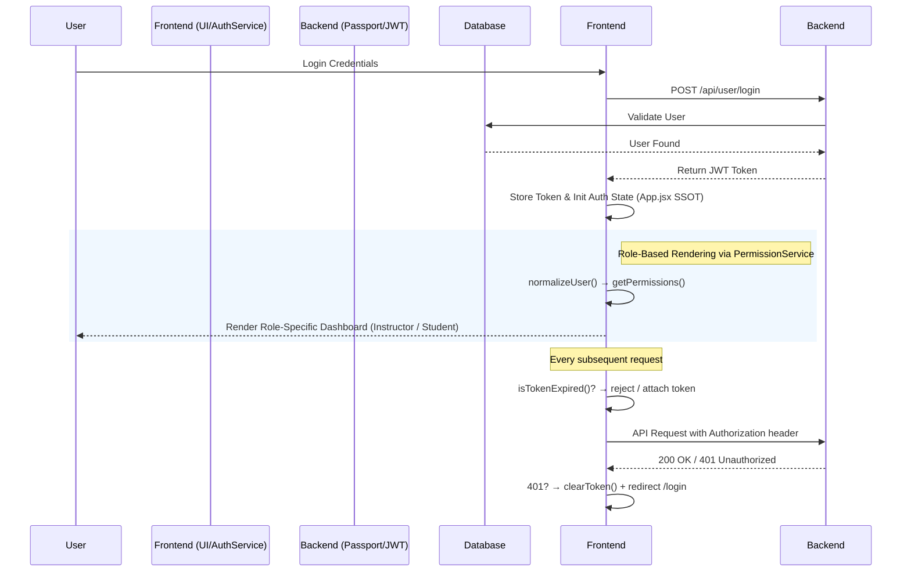

[English](README.md) | [繁體中文](README.zh-TW.md)

# Course Management System - Full-stack Architecture Practice

> This represents more than a standard CRUD portfolio piece; it's a dedicated exploration of "**State Consistency**" and "**Defensive Programming**" within a modern full-stack application. The core focus revolves around centralizing decentralized authentication logic, establishing a robust dual-layered JWT lifecycle defense, and ensuring that no isolated asynchronous failure or UI exception triggers a site-wide crash (White Screen of Death).

- **Live Demo**: [course.tinahu.dev](https://course.tinahu.dev/)
- **Test Accounts**:
  - Student Identity: `demo.student@tinahu.dev` / `DemoCourse2026`
  - Instructor Identity: Registration requires an invitation code (can be provided dynamically during interviews).

---

## Architecture & Engineering Decisions

### 1. State Management: Achieving SSOT while avoiding Overengineering

**The Challenge**: Since the `currentUser` state acts as a dependency across multiple modules—Navigation (rendering identity), Login (writing state), and Interceptors (reading tokens)—any component retaining a stale cache leads to severe sync issues (e.g., UI displays "logged in" while APIs return `401`).

**The Decision**: Without blindly adopting heavy solutions like Redux or Zustand, `App.jsx` was designated as the Single Source of Truth (SSOT). State mutation is tightly controlled, delivering data down the tree via one-way data binding (Props).
```jsx
// App.jsx — Centralized state to ensure unidirectional data flow
const [currentUser, setCurrentUser] = useState(AuthService.getCurrentUser());
```
**Trade-off**: Given the current component depth (< 3 layers), this approach perfectly balances development velocity with state accuracy, bypassing tedious store boilerplate. If cross-component logic scales extensively in the future, the architecture retains the flexibility to pivot seamlessly to Zustand.

---

### 2. Dual-Layer JWT Defense: Client Pre-check & Server Fallback 

**The Decision**: JWT invalidation manifests in two fundamentally different scenarios. The architecture implements a sophisticated "Frontline Pre-check" combined with a "Backend Fallback":

| Defense Layer | Scenario | Implementation Strategy & Benefit |
|------|------|--------|
| **Layer 1: Request Pre-check** | Token `exp` Expiration | Parsed & intercepted actively on the client side before dispatch. **Saves redundant network round-trips** and reduces server verification loads. |
| **Layer 2: Response Fallback** | Token Revoked by Server | Intercepts `401 Unauthorized` responses to execute forced logouts, preventing infinite routing loops. |

```javascript
// axios.service.js (Layer 1 Defense implementation)
if (isTokenExpired(token)) {
  clearToken();
  window.location.href = '/login';
  return Promise.reject(new Error('Token expired')); // Abort dispatch immediately
}
```

---

### 3. Strategy via Adapter Pattern: Isolating API Instability

**The Challenge**: API `User` response payloads may lack structural consistency (e.g., login returns a nested `{ user: { _id, role } }`, while cache loads yield a flat `{ _id, role }`). Forcing UI components to perform their own defensive checks creates a fragile codebase littered with Optional Chaining (`?.`).

**The Decision**: Extracted logic into `PermissionService` utilizing the **Adapter Pattern**. Before any views consume role logic, payloads are universally funneled through `normalizeUser()`.

```javascript
// permission.service.jsx
static normalizeUser(userLike) {
  if (!userLike) return null;
  if (userLike.user && typeof userLike.user === 'object') return userLike.user; // Nested
  if (userLike._id || userLike.id) return userLike;                              // Flat
  return null;
}
```
**The Benefit**: When backend database schemas or API shapes mutate, maintenance is isolated squarely within this single method, achieving true decoupling of data contracts from UI representation.

---

### 4. Advanced Defensive Design Highlights

** (A) Cross-Tab State Synchronization**
If a user spans two browser tabs and logs out on Tab A, Tab B's failure to react presents a critical permission vulnerability. Utilizing the native browser `storage` event construct, the system drives global cross-tab zero-cost state mirroring.
```javascript
// useAuthUser.jsx
window.addEventListener('storage', (e) => {
  if (e.key === 'user') {
    try { setRaw(e.newValue ? JSON.parse(e.newValue) : null); }
    catch { setRaw(null); } // Defensive fallback to prevent Hook crashes from JSON corruption
  }
});
```

** (B) Graceful Degradation via Boundaries (ErrorBoundary + Suspense)**
```jsx
// App.jsx — Standard routing protection wrapper
<ErrorBoundary fallback={<ErrorFallback />}>
  <Suspense fallback={<PageLoader />}>
    <Page {...props} />
  </Suspense>
</ErrorBoundary>
```
The SPA splits dynamic chunks at the route level. While `Suspense` handles deterministic loading states, `ErrorBoundary` proactively quarantines asynchronous render exceptions. One module's internal crash will never compromise the global application integrity.

** (C) Differentiated Promise Error Strategies**
- **Querying** (e.g., Fetching course lists): Exceptions caught at the base layer return an empty array `[]`, defaulting into silent, Graceful Degradation without halting the render cycle.
- **Mutations** (e.g., Dropping a course): Distinctly classifies server rejections (`error.response`) from timeouts (`error.request`), aggressively triggering Toasts so users are explicitly notified of side-effect failures.

---

## System Architecture Diagram



---

## Tech Stack & Trade-offs

| Technology | Reasoning (Engineering Trade-offs) |
|------|----------------------|
| **React 18 + Vite 6** | Abandoned bundle-based tooling for native ESM, slashing Production Build times down to 5.02s (>80% optimization). Concurrent Mode inherently pairs beautifully with our Suspense loading architecture. |
| **React Router v6** | Nested Routes isolate structural layouts from page rendering, enabling `ErrorBoundary` to cover distinct failures globally with exact precision. |
| **Axios (Custom Instance)** | The Interceptor mechanism serves as the backbone for the "Dual-Layer Token Defense". Falling back to native `fetch` would dilute this clean interception into sprawling, duplicate boilerplate. |
| **Joi (Mirrored Schema)** | Syncing frontend form pre-checks with backend verification models ensures **absolute, end-to-end data consistency** from UI input directly to DB insertion. |
| **Passport.js JWT** | Strategy Pattern implementation decouples identity verification from business logic, ensuring frictionless (Open/Closed Principle) scaling if OAuth strategies are integrated later. |
| **Helmet.js** | Yields comprehensive baseline HTTP security headers (CSP, X-Frame-Options) with trivial configuration overhead. |
| **MongoDB + Mongoose** | Features Two-Way Referencing between User & Course models. Valuing read velocity over write normalization, this averts full collection scans and optimizes the heavy read-loads inherently found in LMS applications. |

---

## Getting Started

### 1. Clone Project

```bash
git clone https://github.com/yuting813/course-management-system.git
cd course-management-system
```

### 2. Install Dependencies

```bash
# Backend dependencies
npm install

# Frontend dependencies
npm run clientinstall
```

### 3. Environment Setup

```bash
# Create .env files based on provided examples
cp .env.example .env
cd client && cp .env.example .env
```

| Variable | Description |
|------|------|
| `MONGODB_CONNECTION` | MongoDB Atlas Connection String |
| `JWT_SECRET` | Cryptographic key for JWT signatures |
| `VITE_API_BASE_URL` | Backend API base path for frontend mapping |

### 4. Run Development Server

```bash
npm run dev   # Boots both client and server concurrently
```

### Deployment Pipeline

| Layer | Platform | Strategy |
|------|------|------|
| Frontend Assets | Vercel | Pushed to Edge Network w/ fully automated CI/CD triggers |
| Backend API | Render | Hosted in scalable Node.js runtime environments |
| Database | MongoDB Atlas | Managed cluster with rigid IP Allowlists for foundational security |

---

## About Me

With 6 years steeped in Procurement Management, I habitually engineer workflows tailored for high-risk compliance and rigorous fault tolerance—a mental model I aggressively port into my Frontend Architecture:

- **Procurement Compliance → Mirrored Full-Stack Schemas**: Mandating that polluted data variants are aggressively rejected at the UI entry layer, securing backend boundaries.
- **Supplier Risk Management → Dual-Layer JWT Defense**: Preemptively intercepting known threat states (Expired Tokens) on the frontline, while guaranteeing a defensive fallback for untracked risks (Server Revokes).

To me, "Maintainability and Predictability" are never mere buzzwords; they are the tangible realities accumulated meticulously through thousands of `if (!user) return false` constraints and resilient `catch` blocks.

- **Website**: [tinahu.dev](https://www.tinahu.dev/)
- **GitHub**: [yuting813](https://github.com/yuting813)
- **Email**: [tinahuu321@gmail.com](mailto:tinahuu321@gmail.com)
