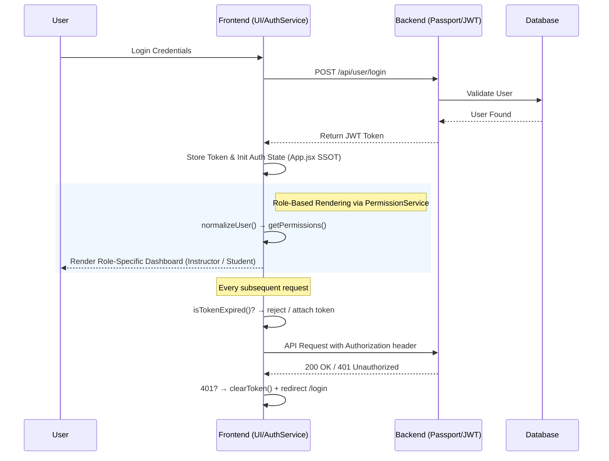

[English](README.md) | [繁體中文](README.zh-TW.md)

# Course Management System — 全端課程管理系統

> 本專案是一個全端架構實踐，核心聚焦於「**狀態一致性 (State Consistency)**」與「**防禦性程式設計 (Defensive Design)**」兩大工程命題。架構設計主要圍繞三大技術挑戰：集中化全域權限邏輯、建立 JWT 生命週期的雙層防禦機制，以及實作系統性邊界防護策略。透過精準限縮錯誤的影響範圍 (Impact Scope)，確保系統在面臨局部模組失效或網路異常等邊緣情境時，仍能**優雅降級 (Graceful Degradation)**，最大程度避免整站崩潰 (White Screen of Death)。

- **Live Demo**：[course.tinahu.dev](https://course.tinahu.dev/)
- **測試帳號**：
  - 學生身分：`demo.student@tinahu.dev` / `DemoCourse2026`
  - 教師身分：講師註冊需邀請碼，面試時可現場提供。

---


---

## 與一般作品集的工程差異 (Engineering Differentiators)

我不只是「做出功能」，更著重「如何解決全端開發中的系統性問題」:

| 一般作品集常見做法         | 本專案的架構實踐                | 帶來的工程價值 (Impact)                        |
| -------------------------- | ------------------------------- | ---------------------------------------------- |
| 前後端各寫一套驗證邏輯     | **Joi Schema 鏡像化設計**       | 從 UI 源頭阻斷髒資料，維護成本大幅降低         |
| 權限判斷散落於各 UI 元件   | **Service 層 Adapter Pattern**  | 抽離 API 結構的不穩定性，視圖層 (View) 零影響  |
| 盲目依賴重型狀態庫 (Redux) | **App.jsx SSOT 單向資料流**     | 針對極淺的元件深度，精準省去無謂的 Boilerplate |
| 放任過期的 Token 送出請求  | **JWT 預檢與 401 兜底雙層防護** | 節省無效網路往返，避免前端陷入重導向死迴圈     |

---

## 核心架構與工程挑戰 (Architecture & Engineering Decisions)

### 1. 狀態管理：實踐 SSOT，有意識地避免 Overengineering

**挑戰**：由於 `currentUser` 狀態會同時被導覽列（顯示身份）、登入頁（狀態寫入）、攔截器（讀取 Token）等多處模組消費。一旦任一節點持有過期快取，便會產生「UI 顯示為登入、API 卻回傳 401」的幽靈狀態異常。

**決策**：在不盲目引入 Redux/Zustand 的前提下，將 `App.jsx` 設為全域唯一的狀態中心 (Single Source of Truth)，其餘消費者皆透過 Props 進行單向觀測。`setCurrentUser` 僅在兩個場景下實際呼叫：登入（`LoginPage`）與登出（`Nav`）。

```jsx
// App.jsx — 狀態集中管理，確保資料單向流動
const [currentUser, setCurrentUser] = useState(AuthService.getCurrentUser());
```

**Trade-off**：在當前組件深度 (< 3 層) 且業務相對聚焦的情境下，此方案完美兼顧了開發效率與狀態精準度，省去複雜的 Store boilerplate。若未來出現大量跨非親子元件的頻繁互動，則具備極高的彈性平滑遷移至 Zustand。

---

### 2. JWT 雙層防禦機制：客戶端預防與伺服器兜底

**決策**：Token 失效有兩種本質不同的情境，系統對此採用了「前線預檢」與「後方兜底」互相配合的雙層防護機制：

| 防禦層級                  | 對應情境               | 實作策略與工程效益                                                                                                      |
| ------------------------- | ---------------------- | ----------------------------------------------------------------------------------------------------------------------- |
| **第一層：Request 預檢**  | Token `exp` 時間到期   | 發送前由 Client 端主動解析攔截，**節省無效網路往返**與減輕伺服器不必要的驗證負載。內建 10 秒 Buffer Time 應對時鐘偏差。 |
| **第二層：Response 兜底** | Token 被伺服器強制撤銷 | 捕捉後端 `401 Unauthorized`，執行自動登出與 Token 清除機制，防止路由發生無限重導。                                      |

```javascript
// axios.service.js（第一層防禦實作）
if (isTokenExpired(token)) {
  clearToken();
  window.location.href = '/login';
  return Promise.reject(new Error('Token expired')); // 直接中斷執行，不傳送無效 Request
}
```

> **邊界設計**：`isTokenExpired()` 採非對稱安全策略——Token 格式異常（遭篡改）時 `return true` 主動登出（偏安全性）；Token 缺少 `exp` 欄位時 `return false` 視為有效（偏容錯性）。

---

### 3. Service 層的 Adapter Pattern：隔離 API 結構的不穩定性

**挑戰**：API 回傳的 `User` 結構存在不一致的可能（例如登入 API 回傳巢狀 `{ user: { _id, role } }`，而 localStorage 讀取回傳扁平 `{ _id, role }`）。若讓 UI 元件各自處理結構差異，將導致專案內充滿脆弱的 Optional Chaining (`?.`) 與 Null Check。

**決策**：封裝 `PermissionService` 並導入 **Adapter Pattern（轉接器模式）**。所有視圖層消費權限邏輯前，皆經過 `normalizeUser()` 將資料標準化。

```javascript
// permission.service.jsx
static normalizeUser(userLike) {
  if (!userLike) return null;
  if (userLike.user && typeof userLike.user === 'object') return userLike.user; // 巢狀結構
  if (userLike._id || userLike.id) return userLike;                              // 扁平結構（同時支援 _id 與 id aliasing）
  return null;
}
```

**效益**：未來若後端 API 資料結構變更，修改範圍僅限於此單一方法，完美實現了將底層資料契約變動與視圖層（View）邏輯隔離。

---

### 4. 進階防禦設計 (Defensive Design) 亮點

**（A）跨頁籤 (Cross-Tab) 狀態雙向同步**

當使用者開啟兩個頁籤，並在 A 頁籤點擊登出時，若 B 頁籤未同步反應，就會發生嚴重的權限安全漏洞。透過原生的 `storage` 事件封裝，實現高效且零成本的全域多頁籤聯動同步：

```javascript
// useAuthUser.jsx
window.addEventListener('storage', (e) => {
  if (e.key === 'user') {
    try {
      setRaw(e.newValue ? JSON.parse(e.newValue) : null);
    } catch {
      setRaw(null);
    } // 避免 JSON 損毀導致 Hook 崩潰，防呆保底
  }
});
```

**（B）邊界防護與優雅降級（ErrorBoundary 雙層縱深 + Suspense）**

架構上採雙層縱深設計：最外層有一個全域 `<ErrorBoundary>` 包住整個 `<Routes>` 作為最終兜底；每個 lazy-loaded 路由則被獨立的 `<ErrorBoundary>` 再次包裹，將錯誤影響範圍限縮至單一頁面。

```jsx
// App.jsx — 雙層縱深防護結構
<ErrorBoundary>
  {' '}
  {/* 全域兜底層（最終防線） */}
  <Routes>
    <ErrorBoundary fallback={<ErrorFallback />}>
      {' '}
      {/* 路由級獨立保護層 */}
      <Suspense fallback={<PageLoader />}>
        {' '}
        {/* 非同步 chunk 載入狀態 */}
        <Page {...props} />
      </Suspense>
    </ErrorBoundary>
  </Routes>
</ErrorBoundary>
```

**（C）讀寫分離的例外處理策略**

- **查詢操作**（如獲取課程清單）：於底層 catch 例外後回傳空陣列 `[]`，讓 UI 進入靜默降級 (Graceful Degradation)，決不中斷整體渲染。
- **寫入操作**（如退選／新增課程）：攔截錯誤後，精準區分伺服器拒絕 (`error.response`) 與網路斷線 (`error.request`)，強制呼叫方顯示 Toast，確保具備副作用的行為得到顯性的出錯回饋。

---

### 5. 前端效能調校與體驗優化 (Web Performance & UX)

在追求系統強健性的同時，本專案也以**「資源 ROI 最佳化」**的思維進行了深度的前端效能調校，對齊現代瀏覽器的 Core Web Vitals 指標：

- **關鍵渲染路徑優化 (Critical Render Path)**：拒絕盲目的全域 Lazy Load。將首頁 (`HomePage`) 維持同步載入以確保最快的 **LCP (最大內容繪製)**；而將二級路由利用 `React.lazy` 進行 Code Splitting，大幅降低首屏的 Initial JS Bundle Size。
- **折疊線下延遲載入 (Below-the-fold Optimization)**：將位於畫面最底端的 `<Footer />` 與非首屏內容進行組件級的 Lazy Load，進一步提升 **TTI (可互動時間)**。
- **網路防禦與漸進式過渡 (Resilient Suspense)**：每一個動態載入的 Chunk 皆配有專屬的 `<Suspense>` 骨架過渡動畫，並被局部 `<ErrorBoundary>` 包裹。即使生產環境因重新部署觸發 `ChunkLoadError`，也能將白屏災難隔離在單一視圖內，達成效能與容錯的完美平衡。

---

## 系統架構圖 (System Architecture)



---

## 技術選型與 Trade-offs

| 技術                         | 選型理由（工程考量）                                                                                                                                                               |
| ---------------------------- | ---------------------------------------------------------------------------------------------------------------------------------------------------------------------------------- |
| **React 18 + Vite 6**        | 使用原生 ESM 取代 Bundle-based 生態，Production Build 縮至 5.02s（>80% 優化）且達到秒級 HMR 開發體驗；Concurrent Mode 完美支援了 Suspense 的 Lazy Loading 防護架構。               |
| **React Router v6**          | Nested Routes + Outlet 結構讓 Layout 殼與頁面渲染邏輯清楚分層，讓 ErrorBoundary 得以最精確的粒度覆蓋異常模組。                                                                     |
| **Axios（自訂 Instance）**   | Interceptor 機制是構建「雙層 Token 防禦」的關鍵基建；若改用原生 `fetch`，將導致核心攔截退化為四處散落的 boilerplate 程式碼。                                                       |
| **Joi（前後端同步 Schema）** | 前端表單預檢與後端路由防護**共享相同的 Schema 結構設計**，如同採購合規中的「規格書鏡像」——確保資料從輸入端到資料庫寫入具有絕對強一致性，從源頭攔截髒資料，降低後端無謂的防禦開銷。 |
| **Passport.js JWT**          | 策略模式（Strategy Pattern）讓身份驗證與業務邏輯解耦，若未來需新增 OAuth，具備開閉原則 (OCP) 的無痛擴展性。                                                                        |
| **Helmet.js**                | 極低成本自動注入 CSP、X-Frame-Options 等安全 HTTP Headers。                                                                                                                        |
| **MongoDB + Mongoose**       | 設計 User 與 Course 的雙向參照（Two-way Referencing）模型。考量 LMS 系統「讀多寫少」，此策略雖提升寫入維護成本，卻能免除 Full Collection Scan，徹底解放讀取效能。                  |

---

## 開發與部署指南 (Getting Started)

### 1. 複製專案

```bash
git clone https://github.com/yuting813/course-management-system.git
cd course-management-system
```

### 2. 安裝依賴

```bash
# 後端依賴
npm install

# 前端依賴
npm run clientinstall
```

### 3. 設定環境變數

```bash
# 根目錄與 client 目錄下分別建立 .env
cp .env.example .env
cd client && cp .env.example .env
```

| 變數                 | 說明                           |
| -------------------- | ------------------------------ |
| `MONGODB_CONNECTION` | MongoDB Atlas 連線字串         |
| `JWT_SECRET`         | JWT 簽名金鑰（請勿使用預設值） |
| `VITE_API_BASE_URL`  | 前端對應的後端 API Base URL    |

### 4. 啟動開發伺服器

```bash
npm run dev   # 透過 concurrently 同時啟動前後端
```

### 部署架構

| 層次         | 平台          | 說明                                             |
| ------------ | ------------- | ------------------------------------------------ |
| 前端靜態資源 | Vercel        | 透過 Edge Network 佈署，自動化 CI/CD pipeline    |
| 後端 API     | Render        | Node.js Runtime 管理                             |
| 資料庫       | MongoDB Atlas | Managed Database，啟用 IP Allowlist 加固底層安全 |

---

## 🛠️ 技術債與架構優化路線圖 (Roadmap)

目前的架構設計優先考量開發速度與核心穩定性。針對未來企業級的規模化需求，我已規劃以下優化方向：

1. **控制器模式重構 (Controller Pattern)**：
   - _現狀_：業務邏輯與路由耦合 (Fat Routes)。
   - _目標_：將邏輯抽離至 `controllers/` 層，提升程式碼的可測試性並符合單一職責原則 (SRP)。

2. **身份驗證規範對齊**：
   - _現狀_：使用自訂 `JWT` Scheme 以利教學理解。
   - _目標_：遷移至工業標準 `Bearer` Scheme (RFC 6750)，確保與第三方 API 網關與安全工具的無縫整合。

3. **集中式錯誤管理**：
   - _現狀_：各路由手動使用 `try-catch` 搭配輔助函式。
   - _目標_：實作全域錯誤處理中間件 (Global Error Middleware)，透過自訂 `AppError` 類別統一全站的錯誤回應結構。

4. **專業日誌系統 (Observability)**：
   - _現狀_：使用基礎的 `console.log` 進行調試。
   - _目標_：整合 Winston 或 Pino 等結構化日誌庫，實現分級日誌 (Levels) 與日誌輪轉 (Rotation)，以利生產環境的稽核與追蹤。

5. **分散式快取機制**：
   - _現狀_：每次身份驗證均直接查詢資料庫。
   - _目標_：導入 Redis 作為快取層，儲存常用使用者資料，大幅降低資料庫 I/O 壓力並提升系統響應速度。

---

## 關於我 (About Me)

身為具備 6 年採購管理背景的工作者，我已深植了「高合規」與「嚴格風險控管」的思維模式。我也將這樣的標準，深度融入我的前端工程設計：

- **採購合規規格 → 前後端鏡像 Schema**：確保任何可能損毀系統的髒資料，在 UI 輸入端的第一時間就被規格攔截。這與採購流程中「規格書定義於需求端，而非驗收端」的邏輯完全一致。
- **供應商風險管控 → JWT 雙層防禦機制**：對於可預視的風險在前線積極阻斷（預檢）；對於不可預測的風險部署防禦兜底。這正是採購風險矩陣的工程翻譯。
- **資源成本控管 → 前端效能優化 (Web Performance)**：如同採購控管預算與物流，我精準控管前端的網路請求與 Bundle Size，優先保障關鍵渲染路徑 (CRP)，確保每一 Byte 的載入都能帶來最高的 UX 投資報酬率 (ROI)。

對我來說，維護性與可預測性從來不是口號，而是由無數個 `if (!user) return false` 與邊界 `catch block` 耐心推砌而成。

- **Website**: [tinahu.dev](https://www.tinahu.dev/)
- **GitHub**: [yuting813](https://github.com/yuting813)
- **Email**: [tinahuu321@gmail.com](mailto:tinahuu321@gmail.com)

---

> **教育用途免責聲明 (Educational Use Disclaimer)**  
> 本專案僅供個人技術展示與學習用途。所有第三方商標、服務名稱及標誌均歸其各自所有者所有。本專案不涉及任何商業行為，亦不與任何第三方服務存在商業附屬關係。
