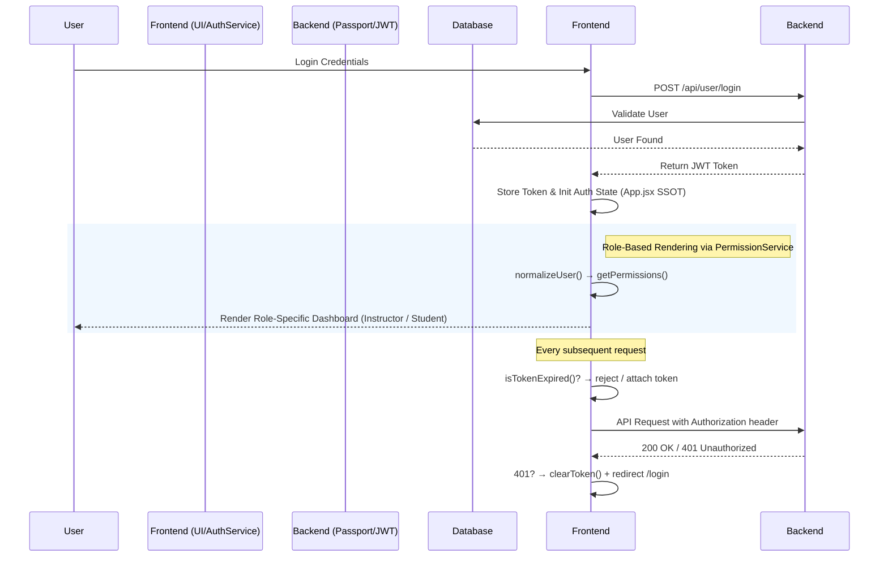

[English](README.md) | [繁體中文](README.zh-TW.md)

# Course Management System — 全端課程管理系統

> 這不是一個單純的 CRUD 作品集，而是一個專注於「**極端狀態一致性 (State Consistency)**」與「**防禦性程式設計 (Defensive Design)**」的全端架構實踐。專案核心在於：將散落的權限邏輯集中化、建立穩健的 JWT 生命週期雙層防禦、並確保任何單一邏輯或網路異常都不會引發整站崩潰 (White Screen of Death)。

- **Live Demo**：[course.tinahu.dev](https://course.tinahu.dev/)
- **測試帳號**：
  - 學生身分：`demo.student@tinahu.dev` / `DemoCourse2026`
  - 教師身分：講師註冊需邀請碼，面試時可現場提供。

---

## 核心架構與工程挑戰 (Architecture & Engineering Decisions)

### 1. 狀態管理：實踐 SSOT，有意識地避免 Overengineering

**挑戰**：由於 `currentUser` 狀態會同時被導覽列（顯示身份）、登入頁（狀態寫入）、攔截器（讀取 Token）等多處模組消費。一旦任一節點持有過期快取，便會產生「UI 顯示為登入、API 卻回傳 401」的幽靈狀態異常。

**決策**：在不盲目引入 Redux/Zustand 的前提下，將 `App.jsx` 設為全域唯一的狀態中心 (Single Source of Truth)，其餘消費者皆透過 Props 進行單向觀測。`setCurrentUser` 僅在兩個場景下實際呼叫：登入（`LoginPage`）與登出（`Nav`）。

```jsx
// App.jsx — 狀態集中管理，確保資料單向流動
const [currentUser, setCurrentUser] = useState(AuthService.getCurrentUser());
```

**Trade-off**：在當前組件深度 (< 3 層) 且業務相對聚焦的情境下，此方案完美兼顧了開發效率與狀態精準度，省去複雜的 Store boilerplate。若未來出現大量跨非親子元件的頻繁互動，則具備極高的彈性平滑遷移至 Zustand。

---

### 2. JWT 雙層防禦機制：客戶端預防與伺服器兜底

**決策**：Token 失效有兩種本質不同的情境，系統對此採用了「前線預檢」與「後方兜底」互相配合的雙層防護機制：

| 防禦層級                  | 對應情境               | 實作策略與工程效益                                                                                                      |
| ------------------------- | ---------------------- | ----------------------------------------------------------------------------------------------------------------------- |
| **第一層：Request 預檢**  | Token `exp` 時間到期   | 發送前由 Client 端主動解析攔截，**節省無效網路往返**與減輕伺服器不必要的驗證負載。內建 10 秒 Buffer Time 應對時鐘偏差。 |
| **第二層：Response 兜底** | Token 被伺服器強制撤銷 | 捕捉後端 `401 Unauthorized`，執行自動登出與 Token 清除機制，防止路由發生無限重導。                                      |

```javascript
// axios.service.js（第一層防禦實作）
if (isTokenExpired(token)) {
  clearToken();
  window.location.href = '/login';
  return Promise.reject(new Error('Token expired')); // 直接中斷執行，不傳送無效 Request
}
```

> **邊界設計**：`isTokenExpired()` 採非對稱安全策略——Token 格式異常（遭篡改）時 `return true` 主動登出（偏安全性）；Token 缺少 `exp` 欄位時 `return false` 視為有效（偏容錯性）。

---

### 3. Service 層的 Adapter Pattern：隔離 API 結構的不穩定性

**挑戰**：API 回傳的 `User` 結構存在不一致的可能（例如登入 API 回傳巢狀 `{ user: { _id, role } }`，而 localStorage 讀取回傳扁平 `{ _id, role }`）。若讓 UI 元件各自處理結構差異，將導致專案內充滿脆弱的 Optional Chaining (`?.`) 與 Null Check。

**決策**：封裝 `PermissionService` 並導入 **Adapter Pattern（轉接器模式）**。所有視圖層消費權限邏輯前，皆經過 `normalizeUser()` 將資料標準化。

```javascript
// permission.service.jsx
static normalizeUser(userLike) {
  if (!userLike) return null;
  if (userLike.user && typeof userLike.user === 'object') return userLike.user; // 巢狀結構
  if (userLike._id || userLike.id) return userLike;                              // 扁平結構（同時支援 _id 與 id aliasing）
  return null;
}
```

**效益**：未來若後端 API 資料結構變更，修改範圍僅限於此單一方法，完美實現了將底層資料契約變動與視圖層（View）邏輯隔離。

---

### 4. 進階防禦設計 (Defensive Design) 亮點

**（A）跨頁籤 (Cross-Tab) 狀態雙向同步**

當使用者開啟兩個頁籤，並在 A 頁籤點擊登出時，若 B 頁籤未同步反應，就會發生嚴重的權限安全漏洞。透過原生的 `storage` 事件封裝，實現高效且零成本的全域多頁籤聯動同步：

```javascript
// useAuthUser.jsx
window.addEventListener('storage', (e) => {
  if (e.key === 'user') {
    try {
      setRaw(e.newValue ? JSON.parse(e.newValue) : null);
    } catch {
      setRaw(null);
    } // 避免 JSON 損毀導致 Hook 崩潰，防呆保底
  }
});
```

**（B）邊界防護與優雅降級（ErrorBoundary 雙層縱深 + Suspense）**

架構上採雙層縱深設計：最外層有一個全域 `<ErrorBoundary>` 包住整個 `<Routes>` 作為最終兜底；每個 lazy-loaded 路由則被獨立的 `<ErrorBoundary>` 再次包裹，將錯誤影響範圍限縮至單一頁面。

```jsx
// App.jsx — 雙層縱深防護結構
<ErrorBoundary>
  {' '}
  {/* 全域兜底層（最終防線） */}
  <Routes>
    <ErrorBoundary fallback={<ErrorFallback />}>
      {' '}
      {/* 路由級獨立保護層 */}
      <Suspense fallback={<PageLoader />}>
        {' '}
        {/* 非同步 chunk 載入狀態 */}
        <Page {...props} />
      </Suspense>
    </ErrorBoundary>
  </Routes>
</ErrorBoundary>
```

**（C）讀寫分離的例外處理策略**

- **查詢操作**（如獲取課程清單）：於底層 catch 例外後回傳空陣列 `[]`，讓 UI 進入靜默降級 (Graceful Degradation)，決不中斷整體渲染。
- **寫入操作**（如退選／新增課程）：攔截錯誤後，精準區分伺服器拒絕 (`error.response`) 與網路斷線 (`error.request`)，強制呼叫方顯示 Toast，確保具備副作用的行為得到顯性的出錯回饋。

---

## 系統架構圖 (System Architecture)



---

## 技術選型與 Trade-offs

| 技術                         | 選型理由（工程考量）                                                                                                                                                               |
| ---------------------------- | ---------------------------------------------------------------------------------------------------------------------------------------------------------------------------------- |
| **React 18 + Vite 6**        | 使用原生 ESM 取代 Bundle-based 生態，Production Build 縮至 5.02s（>80% 優化）且達到秒級 HMR 開發體驗；Concurrent Mode 完美支援了 Suspense 的 Lazy Loading 防護架構。               |
| **React Router v6**          | Nested Routes + Outlet 結構讓 Layout 殼與頁面渲染邏輯清楚分層，讓 ErrorBoundary 得以最精確的粒度覆蓋異常模組。                                                                     |
| **Axios（自訂 Instance）**   | Interceptor 機制是構建「雙層 Token 防禦」的關鍵基建；若改用原生 `fetch`，將導致核心攔截退化為四處散落的 boilerplate 程式碼。                                                       |
| **Joi（前後端同步 Schema）** | 前端表單預檢與後端路由防護**共享相同的 Schema 結構設計**，如同採購合規中的「規格書鏡像」——確保資料從輸入端到資料庫寫入具有絕對強一致性，從源頭攔截髒資料，降低後端無謂的防禦開銷。 |
| **Passport.js JWT**          | 策略模式（Strategy Pattern）讓身份驗證與業務邏輯解耦，若未來需新增 OAuth，具備開閉原則 (OCP) 的無痛擴展性。                                                                        |
| **Helmet.js**                | 極低成本自動注入 CSP、X-Frame-Options 等安全 HTTP Headers。                                                                                                                        |
| **MongoDB + Mongoose**       | 設計 User 與 Course 的雙向參照（Two-way Referencing）模型。考量 LMS 系統「讀多寫少」，此策略雖提升寫入維護成本，卻能免除 Full Collection Scan，徹底解放讀取效能。                  |

---

## 開發與部署指南 (Getting Started)

### 1. 複製專案

```bash
git clone https://github.com/yuting813/course-management-system.git
cd course-management-system
```

### 2. 安裝依賴

```bash
# 後端依賴
npm install

# 前端依賴
npm run clientinstall
```

### 3. 設定環境變數

```bash
# 根目錄與 client 目錄下分別建立 .env
cp .env.example .env
cd client && cp .env.example .env
```

| 變數                 | 說明                           |
| -------------------- | ------------------------------ |
| `MONGODB_CONNECTION` | MongoDB Atlas 連線字串         |
| `JWT_SECRET`         | JWT 簽名金鑰（請勿使用預設值） |
| `VITE_API_BASE_URL`  | 前端對應的後端 API Base URL    |

### 4. 啟動開發伺服器

```bash
npm run dev   # 透過 concurrently 同時啟動前後端
```

### 部署架構

| 層次         | 平台          | 說明                                             |
| ------------ | ------------- | ------------------------------------------------ |
| 前端靜態資源 | Vercel        | 透過 Edge Network 佈署，自動化 CI/CD pipeline    |
| 後端 API     | Render        | Node.js Runtime 管理                             |
| 資料庫       | MongoDB Atlas | Managed Database，啟用 IP Allowlist 加固底層安全 |

---

## 關於我 (About Me)

身為具備 6 年採購管理背景的工作者，我極度習慣在高合規與高容錯要求的環境下設計流程。我也將相同的思維模型深度融入我的前端工程設計：

- **採購合規規格 → 前後端鏡像 Schema**：確保任何可能損毀系統的髒資料，在 UI 輸入端的第一時間就被規格攔截。這與採購流程中「規格書定義於需求端，而非驗收端」的邏輯完全一致。
- **供應商風險管控 → JWT 雙層防禦機制**：對於可預視的風險（Token Expired）在前線積極阻斷；對於不可預測的風險（Server Revoke）部署堅固的防禦兜底。兩種風險性質不同，處置策略也不同——這正是採購風險矩陣的工程翻譯。

對我來說，維護性與可預測性從來不是口號，而是由無數個 `if (!user) return false` 與邊界 `catch block` 耐心推砌而成的真實。

- **Email**：[tinahuu321@gmail.com](mailto:tinahuu321@gmail.com)
