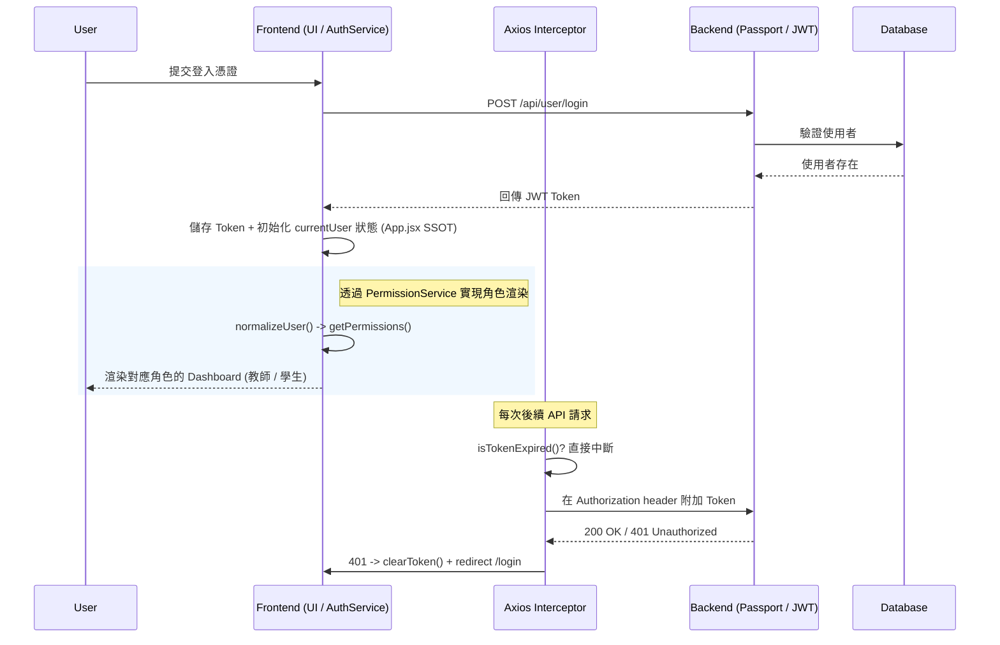

[English](README.md) | [繁體中文](README.zh-TW.md)

# MERN Course Management System — 全端防禦性架構實踐

本專案聚焦於全端 SPA 開發中最難被發現的系統性問題：**身份認證一旦跨越多個非同步邊界，狀態一致性就開始悄悄崩潰**。透過將分散的 auth 邏輯集中為單一資料源、建立 JWT 生命週期的雙層防禦，以及實施系統性錯誤隔離策略，確保即便個別模組發生故障，整體系統仍能維持可預測的行為。

- **Live Demo**：[course.tinahu.dev](https://course.tinahu.dev/)
- **測試帳號**：
  - 學生身分：`demo.student@tinahu.dev` / `DemoCourse2026`
  - 教師身分：講師註冊需邀請碼，面試時可現場提供。

---


---

## 與一般作品集的工程差異 (Engineering Differentiators)

這個專案不是「讓功能跑起來」，而是聚焦在解決大多數作品集默默累積的結構性問題：

| 一般作品集常見做法 | 本專案的設計決策 | 工程理由 |
|---|---|---|
| 前後端各自維護一套驗證邏輯 | **Joi Schema 鏡像化** | 在 UI 邊界阻斷髒資料；單一 Schema 變更對稱地傳播到兩端 |
| 權限判斷散落在各 UI 元件 | **Service 層 Adapter Pattern** | 視圖層 (View) 完全隔離於 API 資料結構變動之外 |
| 盲目引入 Redux/Zustand | **App.jsx SSOT + 單向 Props** | 在 ≤3 層元件深度下，Props 省去 Store boilerplate 且不犧牲狀態精準度 |
| 放任可能過期的 Token 送出請求 | **JWT 雙層防禦（預檢 + 兜底）** | 節省無效網路往返；防止前端陷入 401 無限重導向死迴圈 |

---

## 核心架構與工程決策 (Architecture & Engineering Decisions)

### 1. 狀態管理：實踐 SSOT，有意識地避免 Overengineering

**問題根源**：`currentUser` 同時被三個模組消費——導覽列（顯示身份）、登入頁（狀態寫入）、Axios 攔截器（讀取 Token）。任何一個消費者持有過期快取，系統就進入幽靈狀態：UI 顯示「已登入」，API 卻回傳 `401`。

**設計決策**：在不盲目引入 Redux/Zustand 的前提下，將 `App.jsx` 設為全域唯一的狀態中心 (Single Source of Truth)。`setCurrentUser` 在整個專案中只在兩個場景被呼叫：`LoginPage`（登入時寫入）與 `Nav`（登出時清除）。所有消費者皆透過 Props 接收狀態，不存在隱式訂閱。

```jsx
// App.jsx — 集中管理狀態，透過 Props 強制單向資料流
const [currentUser, setCurrentUser] = useState(AuthService.getCurrentUser());
```

**Trade-off 評估**：在當前元件深度 (<3 層) 且業務聚焦的情況下，此方案完美兼顧開發速度與狀態精準度，省去複雜的 Store boilerplate。若未來出現大量跨非親子元件的頻繁互動，架構設計上已為平滑遷移至 Zustand保留彈性——只需抽取，無需重構現有邏輯。

---

### 2. JWT 雙層防禦機制：客戶端預檢與伺服器兜底

Token 失效有兩種本質不同的情境。若用同一套策略處理兩者，要麼浪費網路往返，要麼陷入不可控的重導向迴圈。本架構在各自適當的層次處理：

| 防禦層級 | 對應情境 | 實作策略與工程效益 |
|---|---|---|
| **第一層：Request 預檢** | Token `exp` 時間到期 | 發送前由 Client 端主動解析攔截，節省無效網路往返與伺服器驗證負載。`isTokenExpired()` 內建 10 秒 Buffer Time 應對時鐘偏差。 |
| **第二層：Response 兜底** | Token 被伺服器強制撤銷 | 捕捉後端 `401 Unauthorized`，執行自動登出與 Token 清除，防止路由發生無限重導向。 |

```javascript
// axios.service.js — 第一層：在 Request 離開 Client 端前直接中斷
if (isTokenExpired(token)) {
  clearToken();
  window.location.href = '/login';
  return Promise.reject(new Error('Token expired')); // 直接中斷，不傳送無效 Request
}
```

**邊界設計**：`isTokenExpired()` 採非對稱安全策略——Token 格式異常（遭篡改）時 `return true` 主動登出（偏安全性）；Token 缺少 `exp` 欄位時 `return false` 視為有效（偏容錯性）。

---

### 3. Service 層 Adapter Pattern：隔離 API 結構的不穩定性

**問題根源**：後端回傳的 `User` 結構存在不一致的可能——登入 API 回傳巢狀 `{ user: { _id, role } }`，而 localStorage 讀取回傳扁平 `{ _id, role }`。若讓 UI 元件各自處理結構差異，將導致專案內充滿脆弱的 Optional Chaining (`?.`) 散落在每個呼叫點。

**設計決策**：封裝 `PermissionService` 並導入 **Adapter Pattern（轉接器模式）**。所有角色與權限邏輯在到達視圖層之前，皆強制通過 `normalizeUser()` 標準化。這是整個專案中處理結構差異的唯一位置。

```javascript
// permission.service.jsx
static normalizeUser(userLike) {
  if (!userLike) return null;
  if (userLike.user && typeof userLike.user === 'object') return userLike.user; // 巢狀結構
  if (userLike._id || userLike.id) return userLike;                              // 扁平結構（同時支援 _id 與 id aliasing）
  return null;
}
```

**效益**：未來若後端 API 資料結構變更，修改範圍僅限於此單一方法。視圖層對底層資料契約的變動完全無感。

---

### 4. 防禦性設計三大結構性保障

**（A）跨頁籤 (Cross-Tab) 狀態同步**

當使用者開啟兩個頁籤，並在 A 頁籤登出時，若 B 頁籤的 auth 狀態未隨之清除，就構成真實的權限安全漏洞。透過原生 `storage` 事件封裝，以零額外成本實現跨頁籤狀態同步：

```javascript
// useAuthUser.jsx
window.addEventListener('storage', (e) => {
  if (e.key === 'user') {
    try { setRaw(e.newValue ? JSON.parse(e.newValue) : null); }
    catch { setRaw(null); } // 防呆保底：JSON 損毀不得讓 Hook 崩潰
  }
});
```

**（B）雙層縱深 ErrorBoundary（優雅降級）**

錯誤隔離採雙層縱深設計：最外層全域 `<ErrorBoundary>` 包住整個 `<Routes>` 作為最終兜底；每個 lazy-loaded 路由被獨立的 `<ErrorBoundary>` 再次包裹，將錯誤影響範圍限縮至單一頁面：

```jsx
// App.jsx — 雙層縱深防護結構
<ErrorBoundary>                                    {/* 全域最終兜底層 */}
  <Routes>
    <ErrorBoundary fallback={<ErrorFallback />}>   {/* 路由級獨立保護層 */}
      <Suspense fallback={<PageLoader />}>          {/* 非同步 chunk 載入狀態 */}
        <Page {...props} />
      </Suspense>
    </ErrorBoundary>
  </Routes>
</ErrorBoundary>
```

單一模組崩潰永遠不會波及整個應用。生產環境重新部署觸發的 `ChunkLoadError`，被隔離在路由邊界內，而非冒泡至根節點。

**（C）讀寫分離的例外處理策略**

- **查詢操作**（如獲取課程清單）：於底層 catch 後回傳空陣列 `[]`，進入靜默降級 (Graceful Degradation)，決不中斷整體渲染。
- **寫入操作**（如退選／新增課程）：攔截錯誤後精準區分伺服器拒絕 (`error.response`) 與網路斷線 (`error.request`)，強制顯示 Toast，確保具有副作用的操作失敗時使用者一定收到明確回饋。

---

### 5. 前端效能調校：關鍵渲染路徑優化

**（A）選擇性 Lazy Load（非盲目全局化）**

`HomePage` 維持同步載入以確保最快的 LCP。二級路由採用 `React.lazy()` 進行 Code Splitting，在不犧牲首屏繪製速度的前提下，大幅縮減初始 JS Bundle Size。

**（B）折疊線下延遲載入**

`<Footer />` 元件與非首屏內容進行組件級 Lazy Load，進一步提升 TTI（可互動時間）。

**（C）ChunkLoadError 容錯設計**

每個動態載入的 Chunk 皆配有專屬的 `<Suspense>` 骨架過渡動畫，並被局部 `<ErrorBoundary>` 包裹。生產環境重新部署導致快取失效時，產生的是隔離的錯誤狀態，而非全頁白屏。

---

## 系統架構圖



---

## 技術選型與 Trade-offs

| 技術 | 選型理由（工程考量） |
|---|---|
| **React 18 + Vite 6** | 使用原生 ESM 取代 Bundle-based 生態，Production Build 縮至 5.02s；Concurrent Mode 完美支援了 Suspense 的 Lazy Loading 防護架構。 |
| **React Router v6** | Nested Routes + Outlet 結構讓 Layout 殼與頁面渲染邏輯清楚分層，讓 ErrorBoundary 得以最精確的粒度覆蓋異常模組。 |
| **Axios（自訂 Instance）** | Interceptor 機制是構建「雙層 Token 防禦」的關鍵基建；若改用原生 `fetch`，將導致核心攔截退化為四處散落的 boilerplate 程式碼。 |
| **Joi（前後端同步 Schema）** | 前端表單預檢與後端路由防護共享相同的 Schema 結構設計——確保資料從 UI 輸入到資料庫寫入具有端對端的強一致性。 |
| **Passport.js JWT** | Strategy Pattern 讓身份驗證與業務邏輯解耦；未來若新增 OAuth，具備開閉原則 (OCP) 的無痛擴展性——現有路由無需變動。 |
| **Helmet.js** | 極低成本自動注入 CSP、X-Frame-Options 等安全 HTTP Headers。 |
| **MongoDB + Mongoose** | 設計 User 與 Course 的雙向參照（Two-way Referencing）模型。考量 LMS 系統「讀多寫少」的特性，此策略雖提升寫入維護成本，卻能免除 Full Collection Scan，徹底釋放讀取效能。 |

---

## 開發與部署指南

### 1. 複製專案

```bash
git clone https://github.com/yuting813/course-management-system.git
cd course-management-system
```

### 2. 安裝依賴

```bash
# 後端依賴
npm install

# 前端依賴
npm run clientinstall
```

### 3. 設定環境變數

```bash
# 根目錄與 client 目錄下分別建立 .env
cp .env.example .env
cd client && cp .env.example .env
```

| 變數 | 說明 |
|---|---|
| `MONGODB_CONNECTION` | MongoDB Atlas 連線字串 |
| `JWT_SECRET` | JWT 簽名金鑰（請勿使用預設值） |
| `VITE_API_BASE_URL` | 前端對應的後端 API Base URL |

### 4. 啟動開發伺服器

```bash
npm run dev   # 透過 concurrently 同時啟動前後端（nodemon + Vite）
```

### 部署架構

| 層次 | 平台 | 說明 |
|---|---|---|
| 前端靜態資源 | Vercel | 透過 Edge Network 佈署，自動化 CI/CD pipeline |
| 後端 API | Render | Node.js Runtime 管理 |
| 資料庫 | MongoDB Atlas | Managed Database，啟用 IP Allowlist 加固底層安全 |

---

## 資料模型

```
users/
  { _id, username, email, password (bcrypt 雜湊，toJSON() 自動剝除), role, date, courses[] }
  ↕ 雙向參照（ObjectId）
courses/
  { _id, title, description, price, instructor (ref User), students[] (ref User), image, createdAt }
```

**Mongoose 中介層設計**：`pre('save')` 在建立或密碼修改時自動雜湊；`toJSON()` 從所有序列化回應中剝除 `password` 欄位——密碼永遠不會離開資料庫層。

---

## 技術債與架構優化路線圖

目前的架構設計優先考量開發速度與核心穩定性。針對未來企業級的規模化需求，已規劃以下優化方向：

1. **控制器模式重構**：業務邏輯目前與路由耦合（Fat Routes）。抽離至 `controllers/` 層可提升程式碼可測試性，並符合單一職責原則 (SRP)。

2. **身份驗證規範對齊**：目前使用自訂 `JWT` Scheme 以利學習理解。遷移至工業標準 `Bearer` Scheme (RFC 6750) 能確保與第三方 API 閘道及安全工具的相容性。

3. **集中式錯誤管理**：各路由目前手動使用 `try-catch`。實作全域錯誤中間件搭配自訂 `AppError` 類別，可統一全站的 JSON 錯誤回應結構。

4. **專業日誌系統**：`console.log` 僅適合開發環境。整合 Winston 或 Pino 等結構化日誌庫，可實現分級日誌 (Levels) 與日誌輪轉 (Rotation)，以利生產環境稽核。

5. **分散式快取層**：每次身份驗證均直接查詢資料庫。導入 Redis 作為 Session/用戶元資料快取層，可有效降低高並發場景下的 DB I/O 壓力。

---

## 關於我

身為具備 6 年採購管理背景的工作者，我早已深植了**預判已知故障模式**與**為不可預測的風險設計兜底策略**的思維慣性。這套心智模型直接對映到軟體架構設計上：

- **採購合規規格 → 前後端鏡像 Schema**：髒資料在 UI 邊界就被攔截，而不是在資料庫層才被發現。
- **供應商風險分級 → JWT 雙層防禦**：已知風險（過期 Token）在前線積極阻斷；未知風險（伺服器強制撤銷）由兜底機制捕捉。
- **預算 ROI 管控 → 前端效能優化**：網路請求與 Bundle Size 被視為受限資源；每一 Byte 的載入都應最大化關鍵渲染路徑 (CRP) 的效益。

對我來說，維護性與可預測性從來不是口號，而是由無數個 `if (!user) return false` 與邊界 `catch` block 耐心推砌而成。

- **Website**: [tinahu.dev](https://www.tinahu.dev/)
- **GitHub**: [yuting813](https://github.com/yuting813)
- **Email**: [tinahuu321@gmail.com](mailto:tinahuu321@gmail.com)

---

> **教育用途免責聲明 (Educational Use Disclaimer)**
> 本專案僅供個人技術展示與學習用途。所有第三方商標、服務名稱及標誌均歸其各自所有者所有。本專案不涉及任何商業行為，亦不與任何第三方服務存在商業附屬關係。
